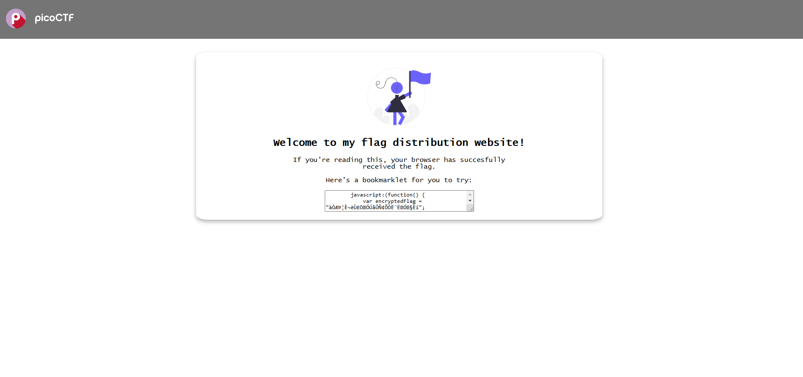
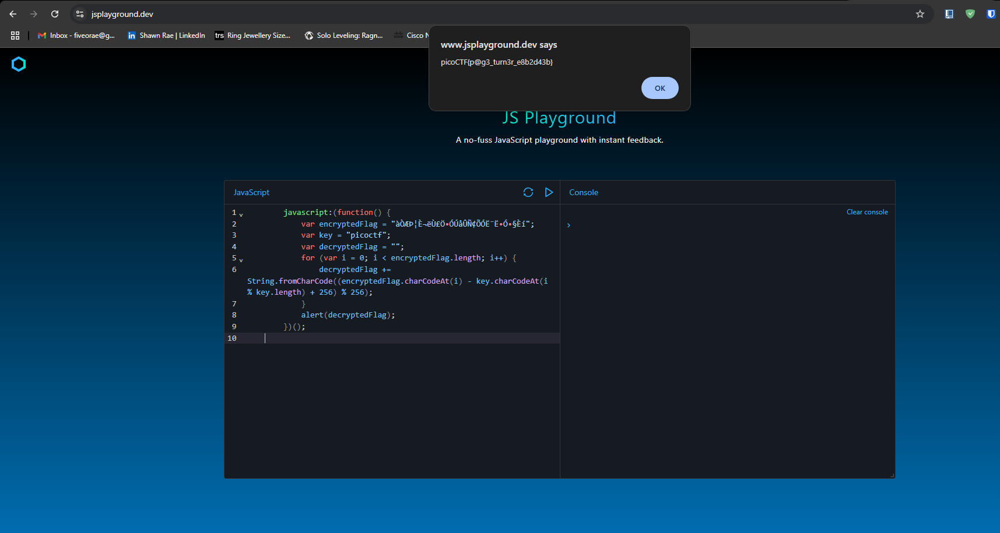

# BOOKMARKLET

For this PicoCTF scenario we are given a website that has a bookmarklet that holds a bunch of javascript code.



New thing I learnt about bookmarklets is that when you click on it it automatically copies the code that is in there:

``` javascript
javascript:(function() {
            var encryptedFlag = "àÒÆަȬë٣֖ÓÚåÛÑ¢ÕÓ˨˕ӗ§Èí";
            var key = "picoctf";
            var decryptedFlag = "";
            for (var i = 0; i < encryptedFlag.length; i++) {
                decryptedFlag += String.fromCharCode((encryptedFlag.charCodeAt(i) - key.charCodeAt(i % key.length) + 256) % 256);
            }
            alert(decryptedFlag);
```

My initial thought was to take the variable encryptedFLag into cyberchef to see if it could decode it, which it didn't based on my own attempt.

What I did after that was to just take the javascript code and put it into an online javascript compiler since it is just a function that at a quick glance does what the task wants us to do. And the output of it gave me the flag which we can see below:



picoCTF{p@g3_turn3r_e8b2d43b} was the flag 