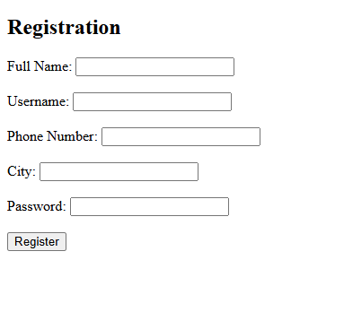

# Introduction to using Burp for CTF

## Objective

Find the Flag hidden somewhere in this website:

Inspecting this first page does nothing for us so that means we are going to have to use burp (as suggested by the task obviously)

----

#Using Burp

What we want to do at this point is:

1. Use BurpSuite to intercept traffic at all stages of filling in the form

So now that we are beginning to intercept the traffic from Burp we will fill in the form. This should get us somehwere after doing so like this:

When we do so we should get what looks like this, which we will use on the repeater which should look like the following:

We get directed to an OTP page but I took the liberty to just not show that on here because its just a single textbox that we use to put whatever we want.

So with the walkthrough i was following it said to use the repeater and then send it to the host but that didn't work for me. HOWEVER, when i just removed the OTP field I got this result:

picoCTF{#0TP_Bypvss_SuCc3$S_b3fa4f1a}

----
## Reflection:

Overall this was an introductory CTF that I found wasn't as straightforward as the challenges prior but I found it to be a lot of fun to make!

My main takeaway from this was that im able to use BurpSuite's interceptor feature to be able to take a look at any web request that can be made to see if there are any factors that I can change to potentially find a way to pass through any security measures and get to where I shouldn't be!