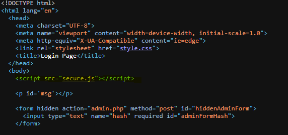

# Local Authority:

``` C 
C:\Users\Shawn>curl -X POST http://saturn.picoctf.net:65116/login.php -- data
<!DOCTYPE html>
<html lang="en">
  <head>
    <meta charset="UTF-8">
    <meta name="viewport" content="width=device-width, initial-scale=1.0">
    <meta http-equiv="X-UA-Compatible" content="ie=edge">
    <link rel="stylesheet" href="style.css">
    <title>Login Page</title>
  </head>
  <body>
    <script src="secure.js"></script>

    <p id='msg'></p>

    <form hidden action="admin.php" method="post" id="hiddenAdminForm">
      <input type="text" name="hash" required id="adminFormHash">
    </form>

    <script type="text/javascript">
      function filter(string) {
        filterPassed = true;
        for (let i =0; i < string.length; i++){
          cc = string.charCodeAt(i);

          if ( (cc >= 48 && cc <= 57) ||
               (cc >= 65 && cc <= 90) ||
               (cc >= 97 && cc <= 122) )
          {
            filterPassed = true;
          }
          else
          {
            return false;
          }
        }

        return true;
      }

      window.username = "";
      window.password = "";

      usernameFilterPassed = filter(window.username);
      passwordFilterPassed = filter(window.password);

      if ( usernameFilterPassed && passwordFilterPassed ) {

        loggedIn = checkPassword(window.username, window.password);

        if(loggedIn)
        {
          document.getElementById('msg').innerHTML = "Log In Successful";
          document.getElementById('adminFormHash').value = "2196812e91c29df34f5e217cfd639881";
          document.getElementById('hiddenAdminForm').submit();
        }
        else
        {
          document.getElementById('msg').innerHTML = "Log In Failed";
        }
      }
      else {
        document.getElementById('msg').innerHTML = "Illegal character in username or password."
      }
    </script>

  </body>
</html>
curl: (6) Could not resolve host: data
```
----

First instinct was to curl using specific command

Provided a hash: 2196812e91c29df34f5e217cfd639881 which is md5 encryption so I am making an assumption that this is probably an admin account (makes sense considering the task.

After entering dummy credentials the page returned with a false login attempt. I checked in the inspect section of that page and got this:



We can see that inspecting it allows us to see a js script with a clickable link that gives us the login and password:


By clicking we can enter and then see the proper admin credentials and with that we found the flag.

----

# SO SORRY I DONT HAVE MORE PHOTOS OR THE FLAG... I did this a while ago and realized I never took photos and whatnot :(