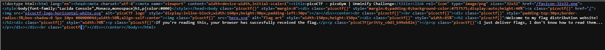
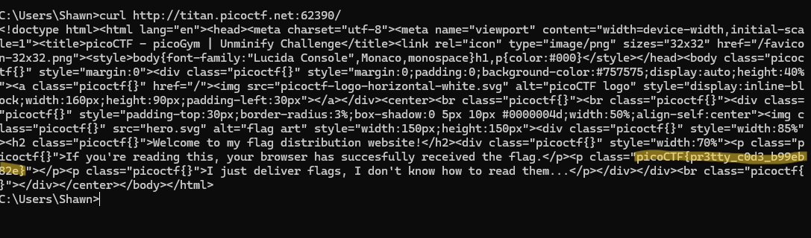

# PICO CTF WEB EXPLOITATION!

----

## Unminify

When we launch the instance we get greeted with the following page:

And upon using the inspect tool we get this:

----

## Breakdown

So clearly we get nothing from this just looking at the web inspector alone, will need to find tools that I can use to get this to work.

I decided to use Curl and got the following result:

Flag - picoCTF{pr3tty_c0d3_622b2c88}

Curl: Command line tool to transfer data using URL syntax.

What it supports: (Variety of things but mainly used for)
1. HTTP
2. HTTPS
3. FTP
